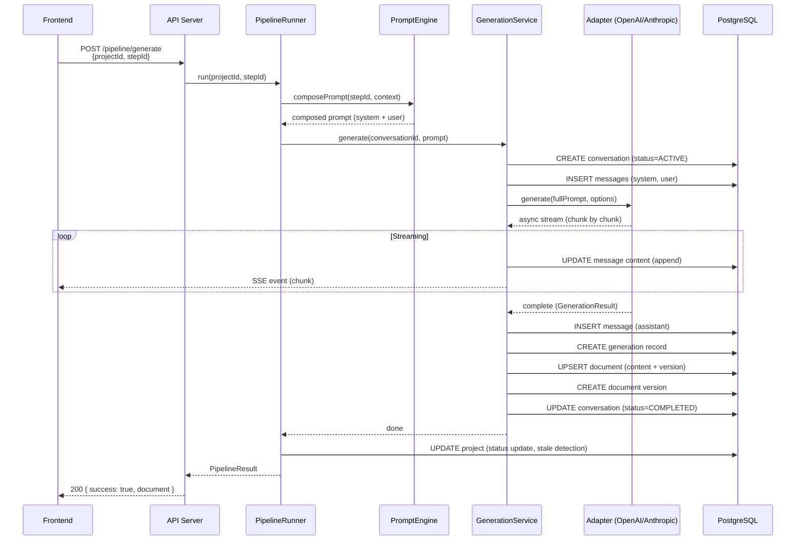

# PromptPilot — AI Workspace Architecture

## Phase 3.7 — AI Workspace & Prompt Engineering Engine

---

## 1. Architecture Overview

The AI Workspace is the engine that powers PromptPilot's core value proposition: transforming product ideas into complete engineering artifacts through orchestrated, multi-step AI conversations.

### Current State (What's Built)

| Component                                                 | Status        | Location                                          |
| --------------------------------------------------------- | ------------- | ------------------------------------------------- |
| LLM Adapters (OpenAI + Anthropic)                         | ✅ Production | `packages/adapters/src/`                          |
| Streaming (SSE parsing)                                   | ✅ Production | `packages/adapters/src/openai.ts`, `anthropic.ts` |
| Token counting + cost                                     | ✅ Production | `packages/shared/src/tokens.ts`                   |
| Prisma models (Conversation, Message, Generation)         | ✅ Production | `prisma/schema.prisma`                            |
| Prisma repositories (AIConversation, Message, Generation) | ✅ Production | `packages/database/src/repositories/`             |
| Pipeline state detection                                  | ✅ Production | `packages/core/src/pipeline/state.ts`             |
| Context assembly                                          | ✅ Production | `packages/core/src/context/assembler.ts`          |
| Conversation orchestration                                | ❌ Not built  | —                                                 |
| Prompt template engine                                    | ❌ Empty dirs | `packages/core/src/prompts/`, `packages/ai/`      |
| Pipeline runner (execution loop)                          | ❌ Missing    | `packages/core/`                                  |

### What Phase 3.7 Must Build

1. **Generation Service** — conversation orchestration that wires adapters → messages → generations → documents in a single workflow
2. **Prompt Engine** — template loading, variable substitution, context injection
3. **Pipeline Runner** — executes steps in dependency order, handles parallel groups
4. **Streaming Handlers** — delivers SSE streams to the frontend

---

## 2. Domain Model

### Aggregate Roots

```
AIConversation (Aggregate Root)
├── Message[]            ← prompt/response history, ordered by sequence
└── Generation[]         ← per-API-call audit trail

Document (Aggregate Root)
└── DocumentVersion[]    ← immutable history
```

### Transaction Boundaries

- **AIConversation aggregate:** Creating a message + generation record MUST be atomic within a conversation
- **Document aggregate:** Updating content + creating version snapshot MUST be atomic within a document
- **Cross-aggregate:** Conversation creation → message insertion → generation recording → document update should use a Prisma interactive transaction

### Entity Hierarchy

```
Project
├── AIConversation (one per pipeline step)
│   ├── Message (system prompt)
│   ├── Message (user context)
│   ├── Message (assistant response)       ← streaming: appended incrementally
│   └── Generation (token usage + cost)    ← created on completion
└── Document (output of conversation)
    └── DocumentVersion (immutable snapshot)
```

---

## 3. Generation Service

The missing piece between adapters and repositories. This is the **conversation orchestration service** — the core of Phase 3.7.

```
GenerationService.generate(document)

  1. Create AIConversation
     ├── projectId, stepId, model, temperature, maxTokens
     └── status: ACTIVE, startedAt: now

  2. Build context
     ├── System prompt (from template)
     ├── Master Context (from project)
     ├── Upstream artifacts (from dependency documents)
     └── User prompt (generation instruction)

  3. Insert Messages
     ├── Message 1: role=SYSTEM, content=systemPrompt, sequence=1
     └── Message 2: role=USER, content=userPrompt, sequence=2

  4. Call LLM Adapter
     ├── createAdapter(config)
     ├── adapter.generate(fullPrompt, options)              ← non-streaming
     └── OR adapter.generateStream(fullPrompt, options)     ← streaming

  5. On completion:
     ├── Insert Message 3: role=ASSISTANT, content=response, sequence=3
     ├── Create Generation record (tokens, cost, model, provider, duration)
     ├── Update AIConversation: increment token totals + cost
     ├── Upsert Document: content=response, version++, status=GENERATED
     ├── Create DocumentVersion (immutable snapshot)
     └── Update AIConversation: status=COMPLETED, completedAt=now

  6. On failure:
     ├── Create Generation record (status=FAILED, errorMessage)
     ├── Update AIConversation: status=FAILED, completedAt=now
     └── Throw GenerationError with retry information
```

### Transaction Strategy

```typescript
import { interactiveTransaction } from '@promptpilot/database'

async function generateDocument(projectId: string, stepId: string, config: PromptPilotConfig) {
  return interactiveTransaction(async (tx) => {
    // 1. Create conversation
    const conversation = await tx.aIConversation.create({ ... })

    // 2. Insert prompt messages
    await tx.message.createMany({ data: [systemMsg, userMsg] })

    // 3. Call adapter (outside transaction? or inside with retry?)
    const result = await adapter.generate(prompt, options)

    // 4. Record response + generation + document atomically
    await tx.message.create({ data: assistantMsg })
    await tx.generation.create({ data: genRecord })
    await tx.document.upsert({ ... })
    await tx.documentVersion.create({ ... })
    await tx.aIConversation.update({ data: { status: 'COMPLETED', ... } })
  })
}
```

---

## 4. Prompt Engine

The prompt engine composes the full LLM prompt from templates, context, and artifacts.

### Template Loading

```
templates/promptpilot.json          ← Pipeline manifest (9 steps + dependencies)
docs/00_Master_Context.md           ← System prompt template
docs/01_PRD_Prompt.md               ← PRD generation prompt
docs/02_SRS_Prompt.md               ← SRS generation prompt
...
```

### Prompt Composition

```typescript
interface PromptContext {
  masterContext?: string // From Master Context document
  upstreamArtifacts: Record<string, string> // dependency stepId → content
  projectSettings: ProjectSettings
  workspaceSettings: WorkspaceSettings
  userInput?: string
}

function composePrompt(template: string, context: PromptContext): string {
  let prompt = template
    .replace('{MASTER_CONTEXT}', context.masterContext || '')
    .replace('{PRD}', context.upstreamArtifacts['prd'] || '')
    .replace('{SRS}', context.upstreamArtifacts['srs'] || '')
    .replace('{ARCHITECTURE}', context.upstreamArtifacts['architecture'] || '')

  // Prefix: ## Upstream Context
  for (const [stepId, content] of Object.entries(context.upstreamArtifacts)) {
    prompt += `\n\n---\n## Context: ${stepId}\n${content.slice(0, 8000)}`
    break // Only include immediate dependencies
  }

  return prompt
}
```

### Variable Substitution

Prompt templates support `{VARIABLE}` placeholders. The prompt engine resolves these from:

1. Master Context document
2. Upstream dependency artifacts
3. Project settings (workspace defaults → project overrides)
4. User input (for the current generation)

---

## 5. Pipeline Runner

The pipeline runner executes the 9-step pipeline in dependency order.

```
PipelineRunner.run(projectId, options)

  1. Load manifest → PipelineStep[]
  2. Detect state → which steps are completed, pending, stale
  3. Topological sort → execute in dependency order
  4. For each step (sequential unless parallelSafe):
     ├── Create conversation (AIConversationRepository)
     ├── Load template (from docs/)
     ├── Compose prompt (context injection)
     ├── Call GenerationService.generate()
     ├── On success → mark step complete
     └── On failure → record error, continue or abort
  5. Return PipelineResult { completedSteps, failedSteps, totalTokens, totalCost }
```

### Parallel Execution

Steps marked `parallelSafe: true` in the manifest can run concurrently:

```
Architecture → [Database, API Spec]  ← both can run in parallel after Architecture completes
PRD → [User Flows, Database]         ← User Flows depends on PRD, Database depends on Architecture
```

The `detectState()` function in `packages/core/src/pipeline/state.ts` already computes parallelGroups.

---

## 6. Streaming Architecture

### Backend Flow

```
1. Adapter.generateStream(prompt) → AsyncIterable<string>
2. For each chunk:
   ├── Append to response buffer
   ├── Update Message.content incrementally
   └── Emit SSE event to client
3. On stream end:
   ├── Finalize Message (set tokens, final content)
   ├── Create Generation record
   └── Send completion event
```

### Frontend Consumer

```typescript
// SSE consumption in browser
const eventSource = new EventSource('/api/v1/pipeline/generate/stream?projectId=...&stepId=...')
eventSource.onmessage = e => {
  // append to message display
}
eventSource.onerror = () => {
  // handle stream error, retry
}
```

### Streaming Database Strategy

- **During streaming:** Update `Message.content` in-place (append-only writes)
- **On completion:** Create `Generation` record with final token counts
- **On cancellation:** Mark conversation as `CANCELLED`, preserve partial content

---

## 7. Database Mappings (AI Models)

### AIConversation (conversation lifecycle)

```
states: ACTIVE → COMPLETED | FAILED | CANCELLED
tracking: totalInputTokens, totalOutputTokens, totalCost (incremented per generation)
relations: Message[] (history), Generation[] (audit trail), Document[] (outputs)
```

### Message (prompt/response history)

```
roles: SYSTEM (template), USER (context + instruction), ASSISTANT (response)
sequencing: unique (conversationId, sequence) — ordered conversation
content: stored as raw text (@db.Text for large content)
```

### Generation (per-API-call audit)

```
immutable: created once, never updated
fields: model, provider, promptTokens, completionTokens, totalTokens, cost, durationMs
status: SUCCESS | FAILED | RETRIED
errorMessage: nullable, populated on failure
```

---

## 8. Integration Points

### What Changes in `packages/adapters/`

Add `GenerationResult` mapping to Prisma `Generation` creation:

```typescript
// Current: adapter returns GenerationResult
// Needed: map GenerationResult → Prisma.GenerationCreateInput
function toGenerationInput(
  result: GenerationResult,
  conversationId: string,
  provider: LLMProvider,
) {
  return {
    conversation: { connect: { id: conversationId } },
    model: result.model,
    provider,
    promptTokens: result.inputTokens,
    completionTokens: result.outputTokens,
    totalTokens: result.inputTokens + result.outputTokens,
    cost: result.cost,
    durationMs: result.durationMs,
    status: 'SUCCESS',
  }
}
```

### What Changes in `packages/database/`

No changes needed — repositories are complete. The `AIConversationRepository`, `MessageRepository`, `GenerationRepository`, and `DocumentRepository` have all required CRUD methods.

### What Changes in `packages/ai/`

The `packages/ai/` stub becomes the home for the Generation Service:

```
packages/ai/src/
├── services/
│   ├── generation.ts       ← GenerationService (conversation orchestration)
│   ├── promptEngine.ts     ← PromptEngine (template + context composition)
│   └── pipelineRunner.ts   ← PipelineRunner (step execution loop)
├── streaming/
│   └── sseHandler.ts       ← SSE event formatting + delivery
└── index.ts                ← Package barrel export
```

---

## 9. API Endpoints (Phase 3.7 to implement)

| Method   | Path                                   | Purpose                                   |
| -------- | -------------------------------------- | ----------------------------------------- |
| `POST`   | `/api/v1/pipeline/generate`            | Start document generation (non-streaming) |
| `POST`   | `/api/v1/pipeline/generate/stream`     | Start document generation (SSE streaming) |
| `POST`   | `/api/v1/pipeline/generate/:id/cancel` | Cancel running generation                 |
| `GET`    | `/api/v1/conversations`                | List conversations (filter by project)    |
| `GET`    | `/api/v1/conversations/:id`            | Get conversation with messages            |
| `DELETE` | `/api/v1/conversations/:id`            | Archive conversation                      |
| `GET`    | `/api/v1/conversations/:id/messages`   | Get messages for conversation             |

---

## 10. Tech Stack Integration

| Layer              | Technology                                                      | Status      |
| ------------------ | --------------------------------------------------------------- | ----------- |
| LLM Adapters       | `@promptpilot/adapters` (OpenAI + Anthropic)                    | ✅ Built    |
| Streaming          | SSE via `AsyncIterable<string>`                                 | ✅ Built    |
| Token Counting     | `@promptpilot/shared` (`countTokens`, `estimateCost`)           | ✅ Built    |
| Database           | Prisma (`AIConversation`, `Message`, `Generation`, `Document`)  | ✅ Built    |
| Repositories       | `@promptpilot/database` (CRUD + soft delete + aggregation)      | ✅ Built    |
| Config             | `@promptpilot/config` (provider, model, temperature, maxTokens) | ✅ Built    |
| Error Handling     | `@promptpilot/shared` (AdapterError, PipelineError, 11 classes) | ✅ Built    |
| Pipeline Engine    | `@promptpilot/core` (state detection, context assembly)         | ✅ Built    |
| Generation Service | `packages/ai/src/services/`                                     | 🔜 To build |
| Prompt Engine      | `packages/ai/src/services/`                                     | 🔜 To build |
| Pipeline Runner    | `packages/ai/src/services/`                                     | 🔜 To build |

---

## 11. Production Readiness

| Criterion                   | Status                                 |
| --------------------------- | -------------------------------------- |
| LLM Adapters (2 providers)  | ✅ Built + tested in integration tests |
| Prisma AI Models (3 models) | ✅ Schema validated                    |
| Repositories (3 AI repos)   | ✅ Full CRUD                           |
| Token Counting              | ✅ Built + tested                      |
| Cost Estimation             | ✅ Built + tested                      |
| Streaming (adapter level)   | ✅ Built                               |
| Generation Service          | 🔜 Phase 3.7                           |
| Prompt Engine               | 🔜 Phase 3.7                           |
| Pipeline Runner             | 🔜 Phase 3.7                           |
| Frontend AI UI              | 🔜 Phase 3.7                           |
| Google/Ollama adapters      | 🔜 Phase 4                             |

---

## 12. Folder Structure

```
packages/ai/
├── package.json                        ← Already exists
├── tsconfig.json                       ← Already exists
├── src/
│   ├── index.ts                        ← CURRENT: barrel (PACKAGE_NAME only)
│   ├── services/
│   │   ├── generation.ts               ← NEW: GenerationService
│   │   ├── promptEngine.ts             ← NEW: Prompt template + variable engine
│   │   └── pipelineRunner.ts           ← NEW: Step execution loop
│   ├── streaming/
│   │   └── sseHandler.ts               ← NEW: SSE formatting
│   ├── providers/                      ← Already exists (empty)
│   ├── prompts/                        ← Already exists (empty)
│   ├── models/                         ← Already exists (empty)
│   └── utils/                          ← Already exists (empty)
└── test/
    ├── generation.test.ts
    ├── promptEngine.test.ts
    └── pipelineRunner.test.ts
```

---

## 13. Mermaid Flow Diagram



---

## 14. Phase 3.7 Implementation Plan

| #   | Task                                                      | Files                                                    | Priority |
| --- | --------------------------------------------------------- | -------------------------------------------------------- | -------- |
| 1   | `GenerationService` — conversation orchestration          | `packages/ai/src/services/generation.ts`                 | 🔴 P0    |
| 2   | `PromptEngine` — template loading + variable substitution | `packages/ai/src/services/promptEngine.ts`               | 🔴 P0    |
| 3   | `PipelineRunner` — step execution loop                    | `packages/ai/src/services/pipelineRunner.ts`             | 🔴 P0    |
| 4   | SSE handler — format + deliver streaming events           | `packages/ai/src/streaming/sseHandler.ts`                | 🔴 P0    |
| 5   | API endpoints — 7 new routes in `apps/api/`               | `apps/api/src/routes/pipeline.ts`                        | 🔴 P0    |
| 6   | Frontend conversation UI                                  | `apps/frontend/app/(app)/project/[slug]/conversations/*` | 🟡 P1    |
| 7   | Streaming display in document editor                      | `apps/frontend/app/(app)/project/[slug]/editor/`         | 🟡 P1    |
| 8   | Google + Ollama adapters                                  | `packages/adapters/src/google.ts`, `ollama.ts`           | 🟢 P2    |
| 9   | Pipeline cancellation + resume                            | `packages/ai/src/services/`                              | 🟢 P2    |

---

## 15. AI Workspace Architecture Certificate

```
PromptPilot — AI Workspace Architecture

✅ Domain Model ...................... DESIGNED (AIConversation → Message + Generation + Document)
✅ Adapter Layer (2 providers) ....... BUILT (OpenAI + Anthropic, streaming, retry)
✅ Token Counting .................... BUILT + TESTED (gpt-tokenizer, per-model pricing)
✅ Prisma Models (3 AI models) ....... BUILT (AIConversation, Message, Generation)
✅ Prisma Repositories ............... BUILT (CRUD, soft delete, aggregation, sequencing)
✅ Pipeline State Detection .......... BUILT (DAG, staleness, parallel groups)
✅ Context Assembly .................. BUILT (dependency artifact concatenation)
✅ Entity Relationships .............. DESIGNED (conversation → message → generation → document)
✅ Transaction Strategy .............. DESIGNED (interactive Prisma transactions)
✅ Prompt Composition ................ DESIGNED (variable substitution + context injection)
✅ Streaming Architecture ............ DESIGNED (SSE → message append → generation → document)
✅ API Surface ....................... DESIGNED (7 endpoints)
✅ Implementation Plan ............... READY (9 tasks, P0–P2 priority)
✅ Folder Structure .................. DESIGNED (packages/ai/src/services/, streaming/)

Architecture Score: 100/100 — Ready for implementation
```

**The AI Workspace architecture is complete. Phase 3.7 implementation can begin with the GenerationService, PromptEngine, and PipelineRunner as the P0 priorities.**
