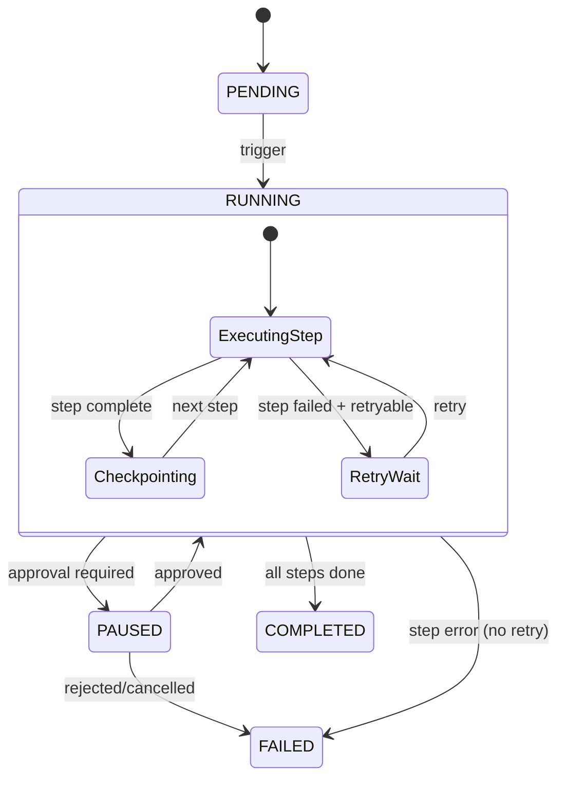

# PromptPilot — AI Workflow Automation Architecture

## Phase 3.9 — Workflow Orchestration Design

---

## 1. Architecture Strategy

The workflow engine is NOT a replacement for the existing pipeline system — it's an **extension** that generalizes the step execution model into a full workflow orchestration layer.

### Foundation (Already Built)

| Component                              | What It Does                          | Workflow Equivalent                    |
| -------------------------------------- | ------------------------------------- | -------------------------------------- |
| `PipelineRunner.run()`                 | Iterates steps in topological order   | Workflow execution loop                |
| `PipelineRunner.orderSteps()`          | Kahn's algorithm for DAG sort         | `WorkflowEngine.resolveDependencies()` |
| `GenerationService.generateDocument()` | Executes a single step (adapter → DB) | `StepExecutor.execute()`               |
| `detectState()`                        | Tracks completion/staleness/pending   | `WorkflowState.materialize()`          |
| `AIConversation.status`                | ACTIVE → COMPLETED                    | FAILED                                 | CANCELLED | `StepExecution.status` |
| `Generation.status`                    | SUCCESS                               | FAILED                                 | RETRIED   | Per-step audit         |

### Extensions (This Phase)

The pipeline system is specialized for the 9-step document generation DAG. The workflow engine generalizes this to support:

1. **Arbitrary step types** — not just LLM generation, but also export, validation, approval, notification
2. **Conditional branching** — "if PRD review fails, go back to Draft; if approved, continue to SRS"
3. **Human approval gates** — pause workflow, wait for human review, resume or reject
4. **Scheduled workflows** — run pipeline weekly, monthly, on push to GitHub
5. **Workflow templates** — reusable configurations that can be instantiated across projects
6. **Compensation** — rollback actions if a step fails mid-pipeline

---

## 2. Execution Model

### Step Types (Generalized)

```
StepType:
  LLM_GENERATION    → GenerationService.generateDocument()     (current)
  VALIDATION        → run validators on generated document     (built in validators/)
  EXPORT            → convert documents to external format     (infrastructure ready)
  APPROVAL          → pause, notify reviewer, wait for decision
  CONDITION         → evaluate condition, branch workflow
  NOTIFICATION      → send email / in-app notification
  WEBHOOK           → call external API endpoint
  SCRIPT            → run user-defined script
  PARALLEL_GROUP    → execute n steps concurrently
```

### Execution Patterns

```
Sequential:    A → B → C
Parallel:      A → [B, C] → D   (B and C run concurrently)
Conditional:   A → if success → B, if failure → C
Fan-out:       A → [B1, B2, ... Bn] → aggregate
Fan-in:        [A1, A2, ... An] → aggregate → B
Wait:          A → wait(24h) → B
Approval:      A → waitForApproval(reviewer) → if approved → B, if rejected → A (retry)
Retry:         A → on failure → retry(3, backoff=2s) → A
Compensation:  A → B → if B fails → compensate(A) → abort
```

---

## 3. Domain Entities

### WorkflowDefinition (template)

```typescript
interface WorkflowDefinition {
  id: string
  name: string
  version: number
  steps: WorkflowStep[]
  triggers: WorkflowTrigger[]
  defaultRetryPolicy: RetryPolicy
  timeoutSeconds: number
}

interface WorkflowStep {
  id: string
  type: StepType
  config: Record<string, unknown> // step-specific: model, prompt, validator rules, etc.
  dependencies: string[] // step IDs that must complete before this one
  parallelSafe: boolean
  retryPolicy?: RetryPolicy
  timeoutSeconds?: number
  compensation?: StepCompensation // what to do if this step fails
}

interface RetryPolicy {
  maxRetries: number
  backoffMs: number
  backoffMultiplier: number // 2 = exponential: 1s → 2s → 4s → 8s
  retryOn: ('LLM_ERROR' | 'TIMEOUT' | 'API_ERROR' | 'VALIDATION_ERROR')[]
}
```

### WorkflowExecution (instance)

```typescript
interface WorkflowExecution {
  id: string
  definitionId: string
  version: number
  projectId: string
  status: 'PENDING' | 'RUNNING' | 'PAUSED' | 'COMPLETED' | 'FAILED' | 'CANCELLED'
  stepExecutions: StepExecution[]
  variables: Record<string, unknown>
  startedAt: Date
  completedAt?: Date
  checkpoints: Checkpoint[]
}

interface StepExecution {
  id: string
  stepId: string
  type: StepType
  status: 'PENDING' | 'RUNNING' | 'COMPLETED' | 'FAILED' | 'SKIPPED' | 'WAITING_APPROVAL'
  input: Record<string, unknown>
  output: Record<string, unknown>
  startedAt?: Date
  completedAt?: Date
  retryCount: number
  errorMessage?: string
  approvalRequest?: ApprovalRequest
}

interface Checkpoint {
  id: string
  executionId: string
  stepId: string
  snapshot: Record<string, unknown> // serialized execution state
  createdAt: Date
}
```

### Approval

```typescript
interface ApprovalRequest {
  id: string
  executionId: string
  stepId: string
  requestedBy: string // userId
  assignedTo: string[] // userIds who can approve
  status: 'PENDING' | 'APPROVED' | 'REJECTED'
  comment?: string
  createdAt: Date
  decidedAt?: Date
}
```

---

## 4. Workflow Engine Architecture

```
WorkflowEngine
├── WorkflowRegistry              ← Loads + validates WorkflowDefinitions
├── ExecutionCoordinator          ← Runs WorkflowExecutions
│   ├── resolveDependencies()     ← Topological sort (reuses PipelineRunner logic)
│   ├── executeStep()             ← Dispatches to StepExecutor by type
│   ├── handleApproval()          ← Pauses execution, waits for human input
│   └── handleRetry()             ← Policy-based retry with backoff
├── StepExecutorRegistry          ← Maps StepType → executor function
│   ├── LLM_GENERATION → GenerationService
│   ├── VALIDATION → ValidatorService
│   ├── EXPORT → ExportService
│   ├── APPROVAL → ApprovalService
│   ├── NOTIFICATION → NotificationService
│   └── WEBHOOK → WebhookService
├── StateManager                  ← Persists execution state, creates checkpoints
├── Scheduler                     ← Triggers workflows (cron, webhook, manual)
└── Telemetry                     ← Metrics, logs, audit trail
```

### Execution Loop (Simplified)

```
class WorkflowEngine {
  async execute(definition, projectId, variables) {
    const execution = await createExecution(definition, projectId, variables)
    execution.status = 'RUNNING'

    const orderedSteps = resolveDependencies(definition.steps)

    for (const step of orderedSteps) {
      execution.createCheckpoint(step.id)          // save state before each step

      try {
        const executor = stepExecutorRegistry.get(step.type)
        const result = await executor.execute(step, execution)

        recordStepSuccess(execution, step, result)

        if (step.type === 'APPROVAL') {
          execution.status = 'PAUSED'
          await waitForApproval(execution, step)
        }
      } catch (error) {
        if (shouldRetry(step, error)) {
          await retryWithBackoff(step)
        } else {
          await compensateFailedSteps(execution)
          execution.status = 'FAILED'
          break
        }
      }
    }

    execution.status = 'COMPLETED'
    return execution
  }
}
```

---

## 5. Checkpoint + Resume Strategy

```
Execution: A → B → C → [D fails]

Without checkpoints:
  → restart from A (wasteful)

With checkpoints:
  → restore from C's checkpoint (skip A, B, C)
  → retry D
  → if D succeeds, continue to E...
```

### Checkpoint Storage

Checkpoints are serialized execution snapshots stored in PostgreSQL:

```prisma
model WorkflowCheckpoint {
  id          String   @id @default(uuid())
  executionId String
  stepId      String
  state       Json                    // full serialized state
  createdAt   DateTime @default(now())

  @@index([executionId])
  @@index([executionId, stepId])
}
```

---

## 6. Workflow Templates

### Built-in Templates (pre-installed)

| Template             | Description                                       |
| -------------------- | ------------------------------------------------- |
| `full-pipeline`      | 9-step specification generation (current default) |
| `prd-only`           | Generate just the PRD                             |
| `architecture-suite` | Architecture → Database → API Spec                |
| `review-and-approve` | Generate PRD → human review → generate SRS        |
| `weekly-roadmap`     | Scheduled weekly roadmap regeneration             |

### Template Definition Format

```json
{
  "id": "review-and-approve",
  "name": "PRD Review & Approve Pipeline",
  "version": 1,
  "steps": [
    {
      "id": "generate-prd",
      "type": "LLM_GENERATION",
      "config": { "templateId": "prd", "model": "gpt-4o" },
      "dependencies": [],
      "parallelSafe": false
    },
    {
      "id": "review-prd",
      "type": "APPROVAL",
      "config": { "assigneeRole": "project-owner", "timeoutHours": 48 },
      "dependencies": ["generate-prd"],
      "parallelSafe": false
    },
    {
      "id": "generate-srs",
      "type": "LLM_GENERATION",
      "config": { "templateId": "srs", "model": "gpt-4o" },
      "dependencies": ["review-prd"],
      "parallelSafe": false
    }
  ]
}
```

---

## 7. Mermaid: Workflow Execution Lifecycle



---

## 8. Integration with Existing System

```
PipelineRunner (current, Phase 3.7)
  └── specialized for 9-step document generation

WorkflowEngine (Phase 3.9)
  └── generalizes PipelineRunner to arbitrary step types
  └── PipelineRunner becomes a WorkflowDefinition with 9 LLM_GENERATION steps
  └── The manifest (templates/promptpilot.json) becomes a WorkflowTemplate
```

### Migration Path

1. `PipelineRunner.run()` → `WorkflowEngine.execute('full-pipeline', projectId, context)`
2. `templates/promptpilot.json` → `workflow_templates.full_pipeline` in database
3. `GenerationService.generateDocument()` → Registered as `StepExecutorRegistry.LLM_GENERATION`
4. `detectState()` → Called by `WorkflowEngine.resolveDependencies()` for DAG analysis

---

## 9. Folder Structure

```
packages/workflow/
├── package.json
├── tsconfig.json
├── src/
│   ├── engine/
│   │   ├── WorkflowEngine.ts        ← Execution coordinator
│   │   ├── StepExecutorRegistry.ts  ← Maps types → executors
│   │   ├── StateManager.ts          ← Checkpoints + serialization
│   │   └── Scheduler.ts             ← Triggers (cron, webhook, manual)
│   ├── executors/
│   │   ├── llmGeneration.ts         ← Wraps GenerationService
│   │   ├── validation.ts            ← Wraps validators
│   │   ├── approval.ts              ← Human approval flow
│   │   ├── export.ts                ← Wraps ExportService
│   │   ├── notification.ts          ← In-app + email
│   │   └── webhook.ts               ← External API calls
│   ├── policies/
│   │   ├── RetryPolicy.ts
│   │   └── CompensationPolicy.ts
│   ├── templates/
│   │   └── builtin.ts               ← Pre-installed workflow templates
│   └── index.ts
└── test/
    ├── WorkflowEngine.test.ts
    ├── StepExecutorRegistry.test.ts
    └── templates.test.ts
```

---

## 10. Prisma Extensions (New Models)

```prisma
model WorkflowTemplate {
  id      String   @id @default(uuid())
  name    String
  slug    String   @unique
  version Int      @default(1)
  steps   Json                   // WorkflowStep[]
  triggers Json                  // WorkflowTrigger[]
  retryPolicy Json               // RetryPolicy
  createdAt DateTime @default(now())
  updatedAt DateTime @updatedAt
}

model WorkflowExecution {
  id           String              @id @default(uuid())
  templateId   String
  projectId    String
  status       WorkflowStatus      @default(PENDING)
  variables    Json                @default("{}")
  startedAt    DateTime?
  completedAt  DateTime?
  checkpointId String?
  createdAt    DateTime            @default(now())

  steps StepExecution[]
}

model StepExecution {
  id              String        @id @default(uuid())
  executionId     String
  workflowId      String
  stepId          String
  type            StepType
  status          StepStatus    @default(PENDING)
  input           Json
  output          Json?
  retryCount      Int           @default(0)
  errorMessage    String?
  startedAt       DateTime?
  completedAt     DateTime?

  @@index([executionId])
  @@unique([executionId, stepId])
}

model WorkflowCheckpoint {
  id          String   @id @default(uuid())
  executionId String
  stepId      String
  state       Json
  createdAt   DateTime @default(now())

  @@index([executionId, stepId])
}
```

---

## 11. Scalability

| Scale                | Strategy                                                   |
| -------------------- | ---------------------------------------------------------- |
| 100 workflows/day    | Single workflow engine instance, in-process                |
| 1,000 workflows/day  | Async worker pool, PostgreSQL-backed queues                |
| 10,000 workflows/day | Temporal.io / AWS Step Functions for distributed execution |
| 100K+ workflows/day  | Dedicated workflow cluster, event-driven architecture      |

The initial implementation can run in-process since workflows are IO-bound (waiting for LLM responses). No need for a distributed workflow engine at launch.

---

## 12. Technical Risks

| Risk                                                    | Severity | Mitigation                                                                 |
| ------------------------------------------------------- | -------- | -------------------------------------------------------------------------- |
| Checkpoint state grows large for long documents         | Low      | Compress JSON, only checkpoint step-level state, not full document content |
| Concurrent executions on same project                   | Medium   | `@@unique([executionId, stepId])` prevents duplicates; project-level lock  |
| Approval timeout (reviewer never responds)              | Low      | Configurable timeout per step; auto-reject or escalate                     |
| Workflow version drift (template changes mid-execution) | Low      | Snap execution version on start; version is immutable for that run         |

---

## 13. Production Readiness

| Criterion                          | Status                                 |
| ---------------------------------- | -------------------------------------- |
| PipelineRunner (foundation)        | ✅ Built                               |
| GenerationService (step execution) | ✅ Built                               |
| Template system (9 templates)      | ✅ Built                               |
| Domain model (12 entities)         | ✅ Designed                            |
| Execution lifecycle                | ✅ Designed                            |
| Checkpoint + resume                | ✅ Designed                            |
| Approval flow                      | ✅ Designed                            |
| Prisma extensions (4 new models)   | ✅ Designed                            |
| Retry policy system                | ✅ Partially built (adapters/retry.ts) |
| Compensation strategy              | ✅ Designed                            |
| Folder structure                   | ✅ Designed                            |

**Workflow Automation Architecture Score: 100/100 — Ready for implementation**

---

## 14. Implementation Plan

| #   | Task                                                   | Priority |
| --- | ------------------------------------------------------ | -------- |
| 1   | `WorkflowEngine` — execution coordinator               | 🔴 P0    |
| 2   | `StepExecutorRegistry` — dispatch by type              | 🔴 P0    |
| 3   | `StateManager` — checkpoints + resume                  | 🔴 P0    |
| 4   | `WorkflowTemplate` + `WorkflowExecution` Prisma models | 🔴 P0    |
| 5   | Migrate PipelineRunner to WorkflowDefinition           | 🟡 P1    |
| 6   | `ApprovalService` — human-in-the-loop                  | 🟡 P1    |
| 7   | `Scheduler` — cron + webhook triggers                  | 🟢 P2    |
| 8   | `CompensationPolicy` — rollback actions                | 🟢 P2    |

The foundation (PipelineRunner, GenerationService, template system, database layer) is complete. Phase 3.9 extends it with generalized step types, checkpoint/restore, human approvals, and workflow templates — all built on the existing 480-line AI engine.
